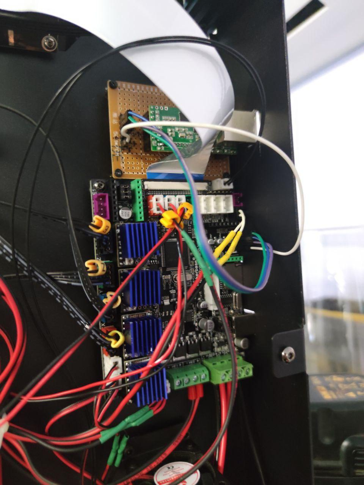
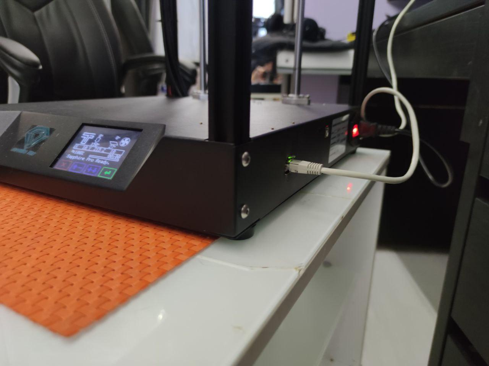

# OctoPrint with lan printer support

Refer to basic [OctoPrint](https://hub.docker.com/r/octoprint/octoprint) docker
repository for basic OctoPrint server setup in docker.

## Ethernet printer

Most of 3D printers has only usb-uart or wifi connectivity setup. This is not
applicable in long-range setups. I has NAS server running in one part of flat
and 3D printer TwoTrees Spphire PRO emplaced at the balcony. Additionally I has
easy-to-update wire network setup hidden in celling.

The USB cable of 10 meters long has the connectivity problems and can suddenly
breaks inside USB stack of kernel. WiFi is unstable too.

So I bought the USR-TCP232-T2 UART-Ethernet converter with simple web-server
setup. I placed it inside printer's box and connected it to UART-1 port of
MKS Robin Nano V1.2 motherboard. And it start work as is without any
modifications.

### Octoprint and Ethernet

The update to Octoprint docker image introduces simple python script, witch
creates pty device and link /dev/ttyEth0 to it. 

For now it supports only one printer and tcp-client mode of UART-Ethernet
converter.

### Configuration

 - Configure Uart-Ethernet converter to connect to your server in tcp-client
   mode.
 - Expose 8234 (default) tcp port for toyr docker container.
 - Add ``/dev/ttyEth*`` to Additional serial ports in OctoPrint configuration
 - Done

### Mounting photos

## Web camera authentication workaround

Most of OctoPrint setups is based on RaspberryPi (OctoPi) which has simple
camera extension which is has extrimply simple configurations. But in
distributed setup you need to buy, mount and configure IP camera. In my case
it is second-hand D'Link DCS-2102, which requires http-authentication without
alternative.

### CameraProxy

Another one simple python script will proxy incoming http requests to
pre-configured server, and authenticates there with pre-configured
credentials.

### Configuration

- Docker environments:

    - ``CAMERA_PROXY_URI`` - URI Prefix to your web camera (required);

    - ``CAMERA_PROXY_USERNAME`` - Username to authenticate on web camera
    (optional, but why all it for?);

    - ``CAMERA_PROXY_PASSWORD`` - Password to authenticate on web camera
    (optional);

    - ``CAMERA_PROXY_PORT`` - Http port to listen on (default: 9097);

- Expose docker port same as ``CAMERA_PROXY_PORT`` from environments;

- Configure Webcam and Timelapse option to the URLS of next view:
``http://<OCTOPRINT_ADDRESS>:<CAMERA_PROXY_PORT>/<WEBCAM_PATH>``, where:

    - ``<OCTOPRINT_ADDRESS>`` you can take from current browser address line,
    just make sure it accessible from all places you are going to connect to
    your server;

    - ``<CAMERA_PROXY_PORT>`` - value from environments;

    - ``<WEBCAM_PATH>`` - is the path on your webcam (for example video/mjpg.cgi
    for video and image/jpeg.cgi for snapshot in by DCS-2102.
